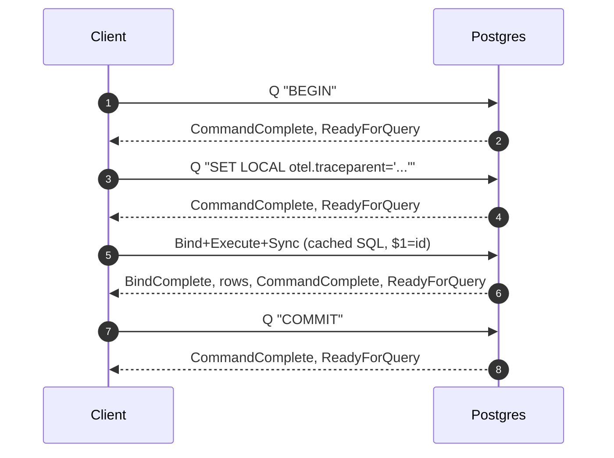
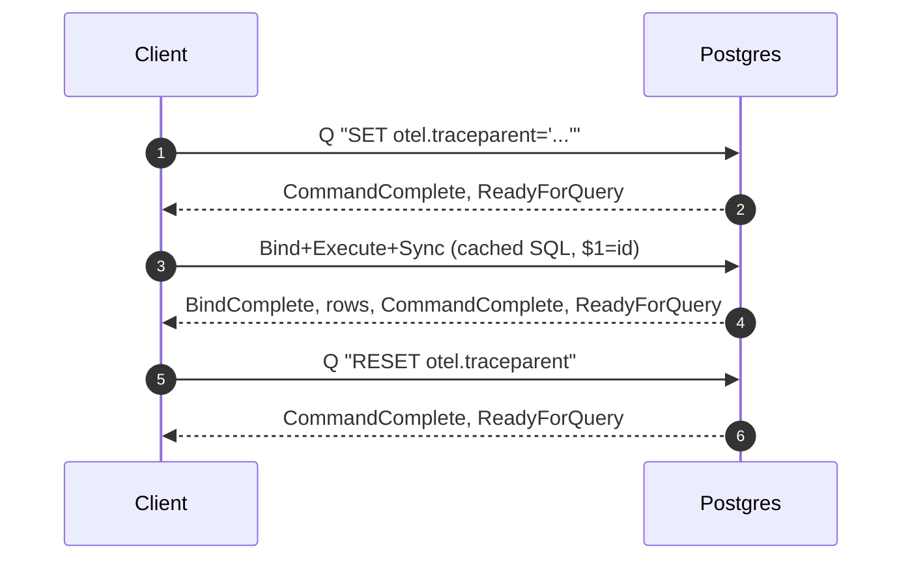
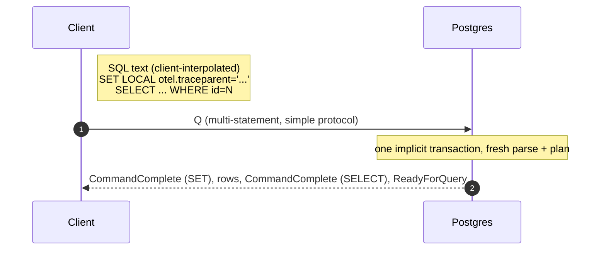
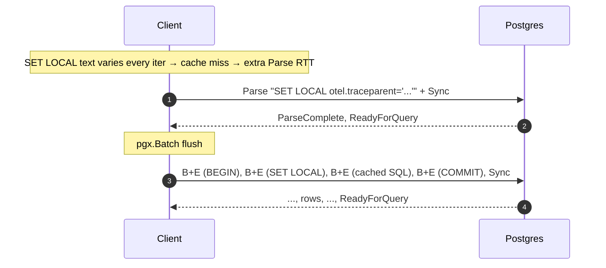
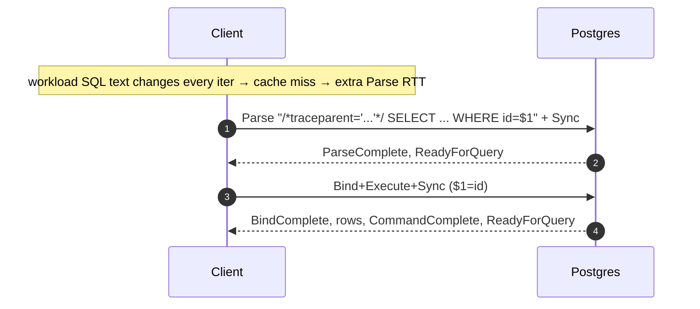
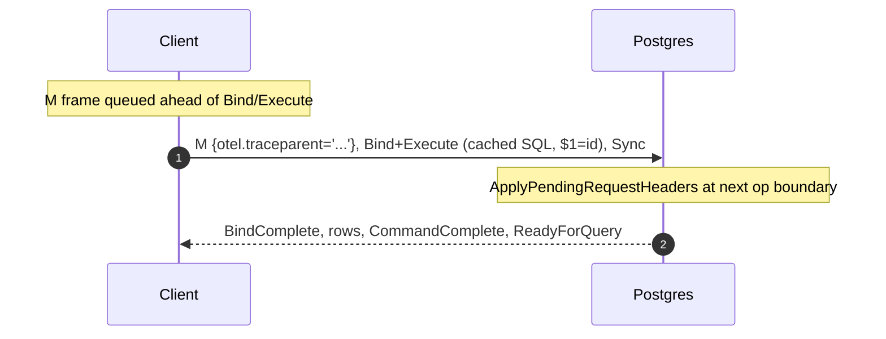

# postgres_otel_tracing_bench

Benchmark and demo harness for comparing trace-context propagation methods
against PostgreSQL with [`contrib/otel`][otel-ext].

This tool is a consumer of the `contrib/otel` extension's public API. It
exercises that API end-to-end: connecting via pgx, attaching a W3C
trace context to each query through every supported propagation channel
(SET LOCAL, sqlcommenter, the `'M'` RequestHeaders frame), and verifying
that contrib/otel picks the context up, emits server-side spans, and
links them under the same `trace_id` as the client-side spans.

To make the protocol-shape delta visible at human-readable percentile
numbers rather than µs-level loopback noise, the harness injects
**simulated network latency** between client and postgres via
[toxiproxy](https://github.com/Shopify/toxiproxy). One-line presets
(`--latency intradc|crossaz|crossregion|intercontinental`) attach
symmetric upstream + downstream toxics so a per-iteration RTT in the
1 ms – 100 ms range is what the benchmark is actually measuring against.

[otel-ext]: https://github.com/ringerc/postgres/tree/postgres-otel-tracing/contrib/otel

### Related work

This repo sits inside a four-PR series against `ringerc/postgres` plus a
sibling demo extension that show the end-to-end picture:

| Component | Where | What |
|---|---|---|
| `contrib/otel` extension | [postgres PR #1][pr1] | The trace-context plumbing + span data model + extension API that this harness exercises. |
| `core: protocol headers` (`'M'`) | [postgres PR #3][pr3] | Adds the `'M'` (RequestHeaders) frontend message and `_pq_.headers=1` negotiation. Required for Mode 4. |
| `core: pre_ready_for_query_hook` | [postgres PR #4][pr4] | Statement-scope hook used by future `contrib/otel` features; not currently exercised by this harness. |
| `core: elog annotations` | [postgres PR #5][pr5] | Generic key/value annotations on `ErrorData` so trace context surfaces in JSON/CSV log output via `%A` / `%{key}A`. Not exercised by benchmark numbers but visible in trace correlation. |
| `postgres_otel_tracing_demo` | [demo extension][demo] | A postgres extension (Rust-built `cdylib`, loaded via `shared_preload_libraries`) that consumes contrib/otel's span-emit hook and ships spans via the real `opentelemetry-rust` SDK. The collector this benchmark talks to typically receives spans from both this harness (client side, via `otelpgx`) and the demo extension (server side, via contrib/otel). |
| **`postgres_otel_tracing_bench`** | this repo | The Go harness — what you're reading. |

[pr1]: https://github.com/ringerc/postgres/pull/1
[pr3]: https://github.com/ringerc/postgres/pull/3
[pr4]: https://github.com/ringerc/postgres/pull/4
[pr5]: https://github.com/ringerc/postgres/pull/5
[demo]: https://github.com/ringerc/postgres_otel_tracing_demo

The three unpatched-pgx modes (1a, 1b, 2a, 2b, 3) work against stock
PostgreSQL with just PR #1 (`contrib/otel`) installed. Mode 4 additionally
requires PR #3 server-side and the [`ringerc/pgx_patches`][pgxp] fork on
the client.

[pgxp]: https://github.com/ringerc/pgx_patches

## What it measures

Per-iteration latency, wire-byte counts, and postgres-side
`pg_stat_statements` / `pg_prepared_statements` deltas for six methods
of attaching a W3C trace context to a SQL workload. See
[docs/results/](docs/results/) for canned reports; the headline at
`crossregion` (~30 ms RTT) is in
[`2026-06-09-crossregion-single.md`](docs/results/2026-06-09-crossregion-single.md).

| Mode | Wire shape | RTTs | Statement cache |
|------|------------|------|-----------------|
| [1a](#mode-1a) | `BEGIN; SET LOCAL otel.traceparent=...; <SQL>; COMMIT;` (sequential) | 4 | hits |
| [1b](#mode-1b) | `SET ...; <SQL>; RESET ...;` (sequential) | 3 | hits |
| [2a](#mode-2a) | `SET LOCAL ...; <SQL>;` as a multi-statement simple `Q` | 1 | **misses** (simple protocol) |
| [2b](#mode-2b) | `pgx.Batch` with `BEGIN/SET LOCAL/<SQL>/COMMIT` under one Sync | 1 | hits |
| [3](#mode-3)  | sqlcommenter SQL-comment prepend | 1 | **misses every iteration** (SQL text changes) |
| [4](#mode-4)  | `M` (RequestHeaders) frontend message | 1 | hits |

Mode 4 requires a patched pgx (see [pgx_patches](#pgx_patches)) and a
patched postgres ([PR #3](https://github.com/ringerc/postgres/pull/3)).

A separate batch suite (B1–B4) runs each propagation method against a
multi-statement workload where one trace context applies to N user
queries.

## What it's not

This isn't a `pgbench` replacement. The workload is intentionally trivial
(one parameterized SELECT or N parameterized SELECTs in a batch) so the
protocol-shape delta isn't drowned by query execution cost. It's also
not a correctness or compatibility test for trace propagation — it
assumes contrib/otel works. contrib/otel ships its own test coverage
(the TAP suites under `contrib/otel/t/` and `contrib/otel_postgres_tracing/t/`
in [PR #1][pr1], plus the test_protocol_headers module in [PR #3][pr3]);
this harness measures performance, not correctness.

## CLI

```
otelbench bench   --modes 1a,1b,2a,2b,3 --latency crossaz --iterations 10000
otelbench bench   --modes 2b,3,4 --latency crossregion --workload batch --batch-size 10
otelbench demo    sqlcommenter-pool-break --iterations 10000
otelbench check
```

## Requirements

- postgres with `contrib/otel` loaded and `pg_stat_statements` in
  `shared_preload_libraries`; for Mode 4, also with
  [PR #3](https://github.com/ringerc/postgres/pull/3) applied.
- [toxiproxy](https://github.com/Shopify/toxiproxy) in front of postgres
  for latency injection.
- An OTLP collector for client-side spans (Jaeger / Tempo / Grafana
  Agent).

**Planned (not yet implemented):** a `docker-compose.yml` that wires up
patched postgres + contrib/otel + toxiproxy + an OTLP collector + Jaeger
will live under `deploy/`. Today the bench is run against locally-started
processes; see the [Running](#running) section.

## Modes — protocol-level rationale

See [`internal/modes/*.go`](internal/modes/) for the per-mode wire-shape
notes. Each mode's per-iteration message sequence in cache-warm steady
state:

<a id="mode-1a"></a>
### Mode 1a: `BEGIN`; `SET LOCAL`; SQL; `COMMIT` (sequential)

The "explicit-transaction SET LOCAL" pattern. Statement cache hits on
the workload SQL (constant text, parameter binding); BEGIN / SET LOCAL /
COMMIT go via the simple-Q path because they have no parameters.



**4 RTT.** Fairest baseline for "what you get if you wrap each
instrumented query in an explicit transaction."

<a id="mode-1b"></a>
### Mode 1b: `SET`; SQL; `RESET` (sequential, no wrapping txn)

Session-level `SET` plus `RESET`. Models the naive instrumentation
pattern that doesn't care whether the caller is in a transaction. Leaks
the session GUC if RESET is skipped.



**3 RTT.**

<a id="mode-2a"></a>
### Mode 2a: multi-statement simple `Q`

Packs `SET LOCAL ...` and the workload SQL into a single `Q` frame
separated by a `;`. Postgres treats a multi-statement simple Q as one
implicit transaction, so SET LOCAL applies to the SQL that follows.
Cheapest on RTT but forces the **simple query protocol**, which has
two structural downsides beyond the cache loss the table already
notes:

- **No server-side parameter binding** — every literal value (the
  traceparent string, the `id` lookup parameter) is client-interpolated
  into the SQL text. Escaping correctness becomes an application
  responsibility instead of being handled by the protocol's typed Bind
  message; mis-escaped values become a SQL-injection vector.
- **No prepared statements** — neither pgx's automatic statement cache
  nor an explicit `PREPARE`/`EXECUTE` path is available, because both
  live exclusively on the v3 extended protocol's Parse/Bind/Execute
  message sequence. Every iteration pays a fresh server-side parse +
  plan regardless of how stable the SQL text is.



**1 RTT.** Cheapest on RTT, most expensive on server-side parse work.

<a id="mode-2b"></a>
### Mode 2b: `pgx.Batch` pipelined under one Sync

`pgx.SendBatch` queues `BEGIN` / `SET LOCAL` / `<SQL>` / `COMMIT` and
flushes with one trailing Sync. In principle one round trip; in practice
the SET LOCAL value differs every iteration, so pgx's automatic statement
cache misses on it and issues a separate `Parse` round trip first.



**2 RTT** in steady state. Workload SQL hits the cache; SET LOCAL doesn't,
and the wrapping transaction adds an XACT_COMMIT WAL record each iter.

Beyond the wire shape, this mode has serious **adoption costs** that don't
show up in the latency numbers:

- **Intrusive application changes.** Every otherwise-standalone query
  becomes a four-step `pgx.Batch` (BEGIN, SET LOCAL, the query, COMMIT)
  that has to be assembled, sent, and result-walked manually. Existing
  call sites that used `conn.Query` / `conn.QueryRow` / `db.SQL` helpers
  all have to be rewritten.
- **Harder result and error handling.** The `BatchResults` returned by
  `SendBatch` has to be walked in queue order, one `.Exec()` / `.Query()`
  call per queued item. Failures in any one item leave the connection
  in an awkward state — the remaining results still need to be drained
  (or the connection discarded) before reuse, and which item failed has
  to be inferred from the index. Compare with `conn.Query`, which gives
  you one error and one rowset directly.
- **Not usable by auto-instrumentation or middleware.** A library that
  wants to add trace propagation transparently — e.g. an `otelpgx`
  equivalent, a `database/sql` driver wrapper, an APM agent — cannot
  rewrite the caller's individual queries into batches without breaking
  the caller's API. This pattern is only available to first-party
  application code that is being modified specifically to support it.

<a id="mode-3"></a>
### Mode 3: sqlcommenter SQL-comment prepend

Prepends `/*traceparent='...',tracestate='...'*/` to the workload SQL.
One round trip on the surface, but pgx's statement cache keys on full
SQL text — with the trace_id in the comment changing every iteration,
the cache misses every time, forcing an extra `Parse` RTT.



**2 RTT**, every iteration. `pg_prepared_statements` grows up to pgx's
LRU cap; the `otelbench demo sqlcommenter-pool-break` subcommand is the
standalone pathology demo.

<a id="mode-4"></a>
### Mode 4: `M` (RequestHeaders) frame + workload SQL

The patched-pgx path. An `M` frame carrying the trace context is queued
on the same Frontend buffer as the next Bind/Execute. The server's
deferred-apply dispatcher attaches the headers to the next P/B/E
boundary, which is the workload SQL we just queued.



**1 RTT**, cache-friendly, no wrapping transaction — the only path that
achieves all three.

## Latency injection

[toxiproxy](https://github.com/Shopify/toxiproxy) is the only mechanism
the harness uses. Presets (`--latency`):

| Preset | One-way | Jitter | RTT |
|--------|---------|--------|-----|
| `none` | 0 | 0 | passthrough (measure toxiproxy overhead) |
| `intradc` | 0.5 ms | ±10% | ~1 ms |
| `crossaz` | 2.5 ms | ±10% | ~5 ms |
| `crossregion` | 15 ms | ±10% | ~30 ms |
| `intercontinental` | 50 ms | ±10% | ~100 ms |

`--sweep-latency` runs every preset in one invocation. Toxiproxy's own
overhead is measured once at startup with the `none` preset and reported
alongside results.

## pgx_patches

Mode 4 requires the patched pgx fork at
[`ringerc/pgx_patches`](https://github.com/ringerc/pgx_patches) (branch
`m-protocol-headers`), which adds the `M` frontend message and the
`_pq_.headers=1` startup negotiation. Build with:

```
go build -tags=patched_pgx ./cmd/otelbench
```

The `replace` directive in `go.mod` swaps in the local checkout when
the tag is set; without the tag the build uses stock `jackc/pgx/v5`
and mode 4 is unregistered.

## Running

Local devcontainer (Go 1.23+ required; the workspace devcontainer ships
it via the `devcontainers/features/go` feature):

```
cd postgres_otel_tracing_bench
go build ./cmd/otelbench
./otelbench check
./otelbench bench --modes 1a --iterations 1000 --latency intradc
```

Docker compose: **not yet implemented.** A planned `deploy/docker-compose.yml`
will wire up patched postgres + contrib/otel + toxiproxy + an OTLP
collector + Jaeger so the published demo runs in one `docker compose up`.
Tracked as a future task; for now, start each piece by hand.

## License

PostgreSQL License — see [LICENSE](LICENSE).
