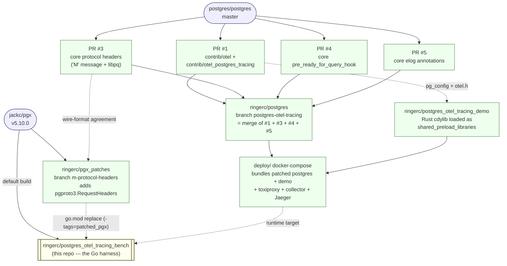
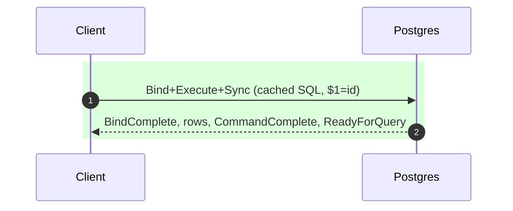
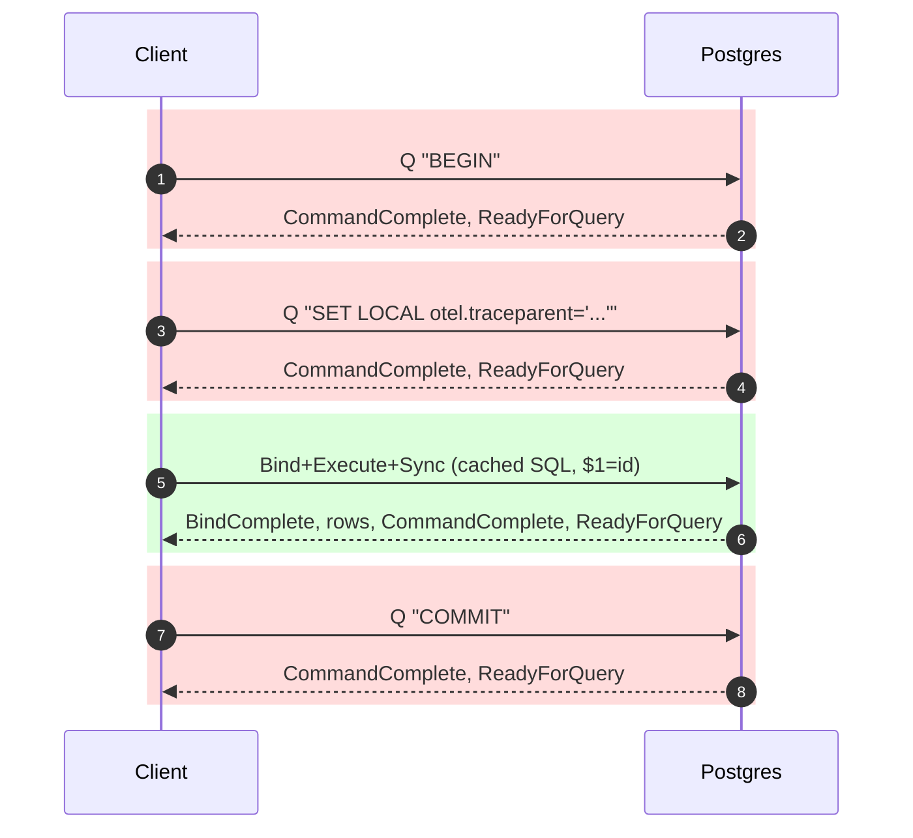
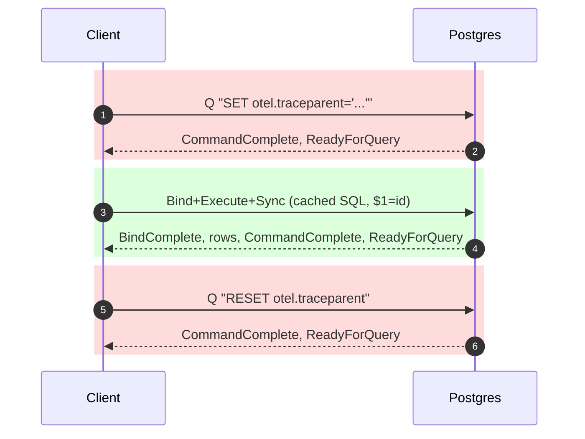
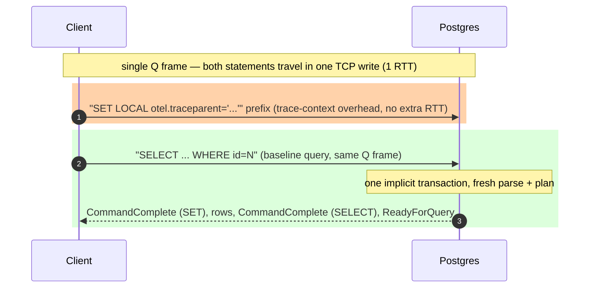
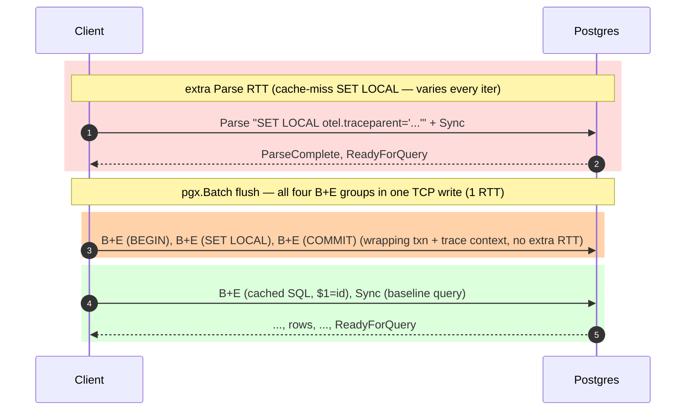
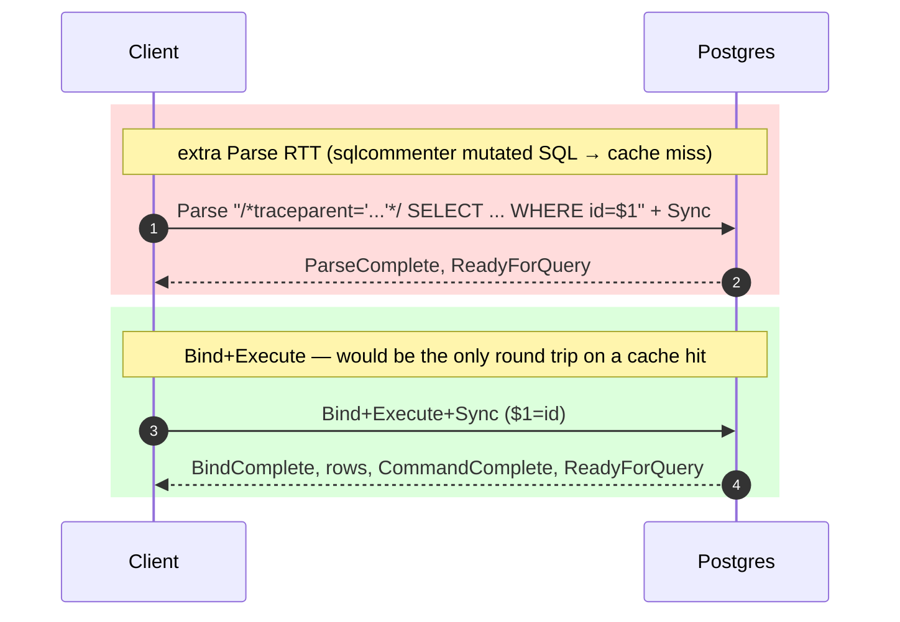
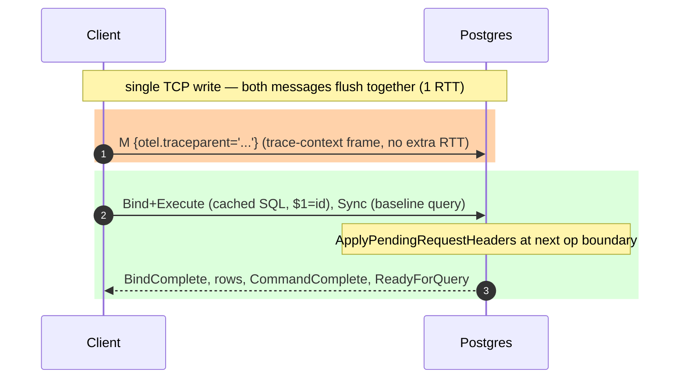

# PostgreSQL OpenTelemetry trace context propagation evaluation tool

(Repository: `postgres_otel_tracing_bench`.)

> [!NOTE]
> This test tool was prepared with significant LLM assistance. Review
> the code, the wire-protocol claims, and the numbers critically before
> citing them; the empirical results have been spot-checked but the
> harness has not been audited line-by-line by a human.

Benchmark and demo harness for comparing trace-context propagation methods
against PostgreSQL with [`contrib/otel`][otel-ext].

This tool is a consumer of the `contrib/otel` extension's public API. It
exercises that API end-to-end: connecting via pgx, attaching a W3C
trace context to each query through every supported propagation channel
(SET LOCAL, sqlcommenter, the `'M'` RequestHeaders frame), and verifying
that contrib/otel picks the context up, emits server-side spans, and
links them under the same `trace_id` as the client-side spans.

To make the protocol-shape delta visible at human-readable percentile
numbers rather than µs-level loopback noise, the harness injects
**simulated network latency** between client and postgres via
[toxiproxy](https://github.com/Shopify/toxiproxy). One-line presets
(`--latency intradc|crossaz|crossregion|intercontinental`) attach
symmetric upstream + downstream toxics so a per-iteration RTT in the
1 ms – 100 ms range is what the benchmark is actually measuring against.

[otel-ext]: https://github.com/ringerc/postgres/tree/postgres-otel-tracing/contrib/otel

### Related work

This harness builds on a `contrib/otel` postgres extension that ships
the trace-context plumbing and extension API, plus a set of optional
postgres and client-driver patches that unlock additional propagation
channels (most importantly the `'M'` RequestHeaders frame for Mode 4).
A sibling demo extension consumes contrib/otel's span-emit hook and
ships spans to an OTel collector. The pieces:

| Component | Where | What |
|---|---|---|
| `contrib/otel` extension | [postgres PR #1][pr1] | The trace-context plumbing + span data model + extension API that this harness exercises. |
| `core: protocol headers` (`'M'`) | [postgres PR #3][pr3] | Adds the `'M'` (RequestHeaders) frontend message and `_pq_.headers=1` negotiation. Required for Mode 4. |
| `core: pre_ready_for_query_hook` | [postgres PR #4][pr4] | Statement-scope hook used by future `contrib/otel` features; not currently exercised by this harness. |
| `core: elog annotations` | [postgres PR #5][pr5] | Generic key/value annotations on `ErrorData` so trace context surfaces in JSON/CSV log output via `%A` / `%{key}A`. Not exercised by benchmark numbers but visible in trace correlation. |
| `postgres_otel_tracing_demo` | [demo extension][demo] | A postgres extension (Rust-built `cdylib`, loaded via `shared_preload_libraries`) that consumes contrib/otel's span-emit hook and ships spans via the real `opentelemetry-rust` SDK. The collector this benchmark talks to typically receives spans from both this harness (client side, via `otelpgx`) and the demo extension (server side, via contrib/otel). |
| **`postgres_otel_tracing_bench`** | this repo | The Go harness — what you're reading. |

[pr1]: https://github.com/ringerc/postgres/pull/1
[pr3]: https://github.com/ringerc/postgres/pull/3
[pr4]: https://github.com/ringerc/postgres/pull/4
[pr5]: https://github.com/ringerc/postgres/pull/5
[demo]: https://github.com/ringerc/postgres_otel_tracing_demo

The three unpatched-pgx modes (1a, 1b, 2a, 2b, 3) work against stock
PostgreSQL with just PR #1 (`contrib/otel`) installed. Mode 4 additionally
requires PR #3 server-side and the [`ringerc/pgx_patches`][pgxp] fork on
the client.

[pgxp]: https://github.com/ringerc/pgx_patches

### How the pieces connect



**Reading the graph.** Blue nodes are upstream; green nodes are work in
the ringerc repos; yellow is this repo. Solid arrows are "is built
from" relationships. Dotted arrows are dependency or interface
agreements (the wire format that PR #3 and `pgx_patches` must agree
on; the headers contrib/otel exposes that the demo extension consumes;
the runtime targets the bench expects to talk to).

The bench has two build modes determined by the `patched_pgx` build
tag: without it, only the upstream `jackc/pgx` solid edge is active
and Mode 4 is unregistered; with it, the dotted `pgx_patches` edge
activates via the `go.mod replace` directive and Mode 4 joins the
registry.

## Synopsis

The `'M'` (RequestHeaders) protocol message proposed in
[postgres PR #3][pr3] gives PostgreSQL a low-overhead, side-effect-free
channel for per-query trace-context propagation. The benchmark in this
repo measures its overhead at **+0.5 % at WAN latency** and **+5 % at
intra-AZ**, within the noise floor of an untraced cache-hit
`Bind`+`Execute`+`Sync`. Every alternative approach measured here
(sequential `SET LOCAL`, session `SET`/`RESET`, multi-statement
simple `Q`, `pgx.Batch` wrapping transactions, sqlcommenter comments)
imposes between **+100 %** and **+300 %** overhead over the same
baseline, and brings at least one structural side effect:

- **More round trips.** Modes 1a, 1b force 3–4 sequential RTTs.
  Modes 2b and 3 advertise one RTT but pay a hidden second one
  whenever the trace context varies per call (it always does), because
  the varying text defeats pgx's automatic statement cache.
- **Breaks prepared statements / statement caching.** Mode 2a forces
  the simple query protocol, losing both `Parse`/`Bind`/`Execute` and
  `PREPARE`/`EXECUTE`. Mode 3 (sqlcommenter) makes every cache key
  unique, so the LRU churns ([jackc/pgx#1935][pgx1935]).
- **Requires intrusive application changes.** Mode 2b replaces each
  standalone query with a four-statement `pgx.Batch`; existing
  `conn.Query` / `conn.QueryRow` / ORM call sites have to be
  rewritten, and error handling becomes "walk the batch results in
  queue order".

The `'M'` message avoids all three. And because the trace context
lives in a separate wire frame instead of in the SQL text, transaction
state, or call structure, **middleware can inject it transparently** —
a driver-level shim (`otelpgx` registered as `ConnConfig.Tracer`, a
`database/sql` wrapper, an APM agent) can attach trace context to
every Query/Exec without the application code being modified. None of
the existing approaches has that property. See
[Mode 4](#mode-4) for the wire-level shape and
[the cost table](#what-it-measures) for the numbers.

[pgx1935]: https://github.com/jackc/pgx/issues/1935

## What it measures

Per-iteration latency, wire-byte counts, and postgres-side
`pg_stat_statements` / `pg_prepared_statements` deltas for six methods
of attaching a W3C trace context to a SQL workload. See
[docs/results/](docs/results/) for canned reports; the headline at
`crossregion` (~30 ms RTT) is in
[`2026-06-09-crossregion-single.md`](docs/results/2026-06-09-crossregion-single.md).

<table>
  <thead>
    <tr>
      <th rowspan="3">Mode</th>
      <th rowspan="3">Wire shape</th>
      <th rowspan="3">RTTs</th>
      <th rowspan="3">Statement cache</th>
      <th colspan="4">tracing cost vs <a href="#mode-0">Mode 0</a> baseline³</th>
    </tr>
    <tr>
      <th colspan="2">intra-AZ¹</th>
      <th colspan="2">WAN²</th>
    </tr>
    <tr>
      <th>time</th><th>%</th>
      <th>time</th><th>%</th>
    </tr>
  </thead>
  <tbody>
    <tr>
      <td><a href="#mode-0">0</a></td>
      <td>Untraced baseline — workload SQL only</td>
      <td>1</td>
      <td>hits</td>
      <td>2.6 ms</td><td>—</td>
      <td>30.2 ms</td><td>—</td>
    </tr>
    <tr>
      <td><a href="#mode-1a">1a</a></td>
      <td><code>BEGIN; SET LOCAL ...; &lt;SQL&gt;; COMMIT;</code> (sequential)</td>
      <td>4</td>
      <td>hits</td>
      <td>10.4 ms</td><td><b>+300 %</b></td>
      <td>121 ms</td><td><b>+300 %</b></td>
    </tr>
    <tr>
      <td><a href="#mode-1b">1b</a></td>
      <td><code>SET ...; &lt;SQL&gt;; RESET ...;</code> (sequential)</td>
      <td>3</td>
      <td>hits</td>
      <td>7.6 ms</td><td><b>+190 %</b></td>
      <td>91 ms</td><td><b>+200 %</b></td>
    </tr>
    <tr>
      <td><a href="#mode-2a">2a</a></td>
      <td><code>SET LOCAL ...; &lt;SQL&gt;;</code> as multi-statement simple <code>Q</code></td>
      <td>1</td>
      <td><b>misses</b> (simple protocol)⁶</td>
      <td>2.5 ms</td><td><b>~0 %</b>⁵</td>
      <td>30.5 ms</td><td><b>+1 %</b></td>
    </tr>
    <tr>
      <td><a href="#mode-2b">2b</a></td>
      <td><code>pgx.Batch</code> with <code>BEGIN/SET LOCAL/&lt;SQL&gt;/COMMIT</code> under one Sync</td>
      <td>2⁴</td>
      <td>hits</td>
      <td>5.2 ms</td><td><b>+100 %</b></td>
      <td>60.5 ms</td><td><b>+100 %</b></td>
    </tr>
    <tr>
      <td><a href="#mode-3">3</a></td>
      <td>sqlcommenter SQL-comment prepend</td>
      <td>2⁴</td>
      <td><b>misses every iteration</b> (SQL text changes)</td>
      <td>5.4 ms</td><td><b>+110 %</b></td>
      <td>61 ms</td><td><b>+100 %</b></td>
    </tr>
    <tr>
      <td><a href="#mode-4">4</a></td>
      <td><code>M</code> (RequestHeaders) frontend message</td>
      <td>1</td>
      <td>hits</td>
      <td>2.7 ms</td><td><b>+5 %</b></td>
      <td>30.3 ms</td><td><b>+0.5 %</b></td>
    </tr>
  </tbody>
</table>

¹ intra-AZ figures are p50 from a 500-iteration bench run at the
`intradc` toxiproxy preset (1 ms one-way, ~2 ms RTT).

² WAN figures are p50 from a 300-iteration bench run at the
`crossregion` toxiproxy preset (15 ms one-way, ~30 ms RTT). See also
[`docs/results/2026-06-09-crossregion-single.md`](docs/results/2026-06-09-crossregion-single.md).

³ The `%` column for every traced row is computed against
[Mode 0](#mode-0)'s `time` cell at the same preset. Mode 0 is the
harness's explicit "no-propagation" baseline — pgx's normal cache-hit
`Bind`+`Execute`+`Sync` issuing the same workload SQL with no trace
context attached. Mode 0's own `%` cell shows `—` because the
comparison would be against itself.

⁴ Modes 2b and 3 would be 1 RTT if the SET LOCAL value (2b) or the
sqlcommenter SQL comment (3) didn't vary every iteration — but they do,
so pgx's automatic statement cache misses every call and pays an extra
`Parse` round trip. See the per-mode diagrams.

⁵ Mode 2a's measured p50 at intra-AZ is ~90 µs **below** the Mode 0
baseline; reported as `~0 %` rather than a negative overhead. This is
within p50 measurement noise at 500 iterations, and is plausible given
that simple `Q` (Mode 2a) sends marginally fewer bytes than
extended-protocol `Bind`+`Execute`+`Sync` (Mode 0) even after the
SET LOCAL prefix.

⁶ Mode 2a forces the **simple query protocol** and so structurally
breaks two extended-protocol features the bench relies on elsewhere:

  * **No prepared statements.** Neither pgx's automatic statement
    cache nor explicit `PREPARE`/`EXECUTE` is reachable — both live on
    the v3 extended-protocol Parse/Bind/Execute path. Every iteration
    pays a fresh server-side parse + plan regardless of how stable
    the SQL text is.
  * **No parameter binding.** Every literal in the SQL (the `id`
    lookup value, the traceparent string itself) is client-interpolated
    into the text. Escape correctness becomes an application
    responsibility instead of a protocol guarantee; mis-escaped values
    become a SQL-injection vector.

The headline `time` / `%` numbers don't surface these costs — they're
visible in the per-mode prose and in `pg_stat_statements` (Mode 2a's
delta of 1 distinct row vs Mode 4's 0).

Mode 4 requires a patched pgx (see [pgx_patches](#pgx_patches)) and a
patched postgres ([PR #3](https://github.com/ringerc/postgres/pull/3)).

A separate batch suite (B1–B4) runs each propagation method against a
multi-statement workload where one trace context applies to N user
queries.

## What it's not

This isn't a `pgbench` replacement. The workload is intentionally trivial
(one parameterized SELECT or N parameterized SELECTs in a batch) so the
protocol-shape delta isn't drowned by query execution cost. It's also
not a correctness or compatibility test for trace propagation — it
assumes contrib/otel works. contrib/otel ships its own test coverage
(the TAP suites under `contrib/otel/t/` and `contrib/otel_postgres_tracing/t/`
in [PR #1][pr1], plus the test_protocol_headers module in [PR #3][pr3]);
this harness measures performance, not correctness.

## CLI

```
otelbench bench   --modes 1a,1b,2a,2b,3 --latency crossaz --iterations 10000
otelbench bench   --modes 2b,3,4 --latency crossregion --workload batch --batch-size 10
otelbench demo    sqlcommenter-pool-break --iterations 10000
otelbench check
```

## Requirements

- postgres with `contrib/otel` loaded and `pg_stat_statements` in
  `shared_preload_libraries`; for Mode 4, also with
  [PR #3](https://github.com/ringerc/postgres/pull/3) applied.
- [toxiproxy](https://github.com/Shopify/toxiproxy) in front of postgres
  for latency injection.
- An OTLP collector for client-side spans (Jaeger / Tempo / Grafana
  Agent).

A [`deploy/`](deploy/) directory ships a `docker-compose.yml` that
brings up patched postgres (with `contrib/otel` +
`contrib/otel_postgres_tracing` + the
[`postgres_otel_tracing_demo`](https://github.com/ringerc/postgres_otel_tracing_demo)
Rust extension loaded), toxiproxy, an OTel collector, and Jaeger.
First-time build is slow (~15–20 min for the patched-postgres image)
but only happens once. See [`deploy/README.md`](deploy/README.md) for
the bring-up commands. The compose stack is **not yet end-to-end
verified by the author** — file an issue if pieces are broken.

## Modes — protocol-level rationale

See [`internal/modes/*.go`](internal/modes/) for the per-mode wire-shape
notes. Each mode's per-iteration message sequence in cache-warm steady
state follows.

**Diagram colour key.** Each `rect` block highlights one of three things:

- 🟢 **green** — the baseline. What would be on the wire for the same
  query without trace propagation.
- 🔴 **red** — trace-propagation overhead that **adds a new round trip**.
  This is the worst category: latency directly proportional to network
  RTT.
- 🟠 **orange** — trace-propagation overhead that **doesn't add a new
  round trip**. Extra wire bytes and/or extra server-side processing
  bundled into a round trip that would have happened anyway. Cost
  scales with bandwidth and server CPU, not RTT.

<a id="mode-0"></a>
### Mode 0: untraced baseline (no propagation)

The reference point against which the other modes are measured. The
workload SQL goes through pgx's normal extended-protocol path —
`Bind`+`Execute`+`Sync` against a cached prepared statement — with
nothing attached to identify the trace context to the server. One
round trip, statement cache hits, no wrapping transaction.



**1 RTT.** Every block is green: nothing here is overhead, because
there is no tracing. The other modes' overhead is measured against
this.

<a id="mode-1a"></a>
### Mode 1a: `BEGIN`; `SET LOCAL`; SQL; `COMMIT` (sequential)

The "explicit-transaction SET LOCAL" pattern. Statement cache hits on
the workload SQL (constant text, parameter binding); BEGIN / SET LOCAL /
COMMIT go via the simple-Q path because they have no parameters.



**4 RTT** — only the third is the query you'd issue anyway; the other
three are pure trace-propagation overhead. Fairest baseline for "what
you get if you wrap each instrumented query in an explicit
transaction."

<a id="mode-1b"></a>
### Mode 1b: `SET`; SQL; `RESET` (sequential, no wrapping txn)

Session-level `SET` plus `RESET`. Models the naive instrumentation
pattern that doesn't care whether the caller is in a transaction. Leaks
the session GUC if RESET is skipped.



**3 RTT** — middle round trip is the query; the SET and RESET bracketing
it are overhead.

<a id="mode-2a"></a>
### Mode 2a: multi-statement simple `Q`

Packs `SET LOCAL ...` and the workload SQL into a single `Q` frame
separated by a `;`. Postgres treats a multi-statement simple Q as one
implicit transaction, so SET LOCAL applies to the SQL that follows.
Cheapest on RTT but forces the **simple query protocol**, which has
two structural downsides beyond the cache loss the table already
notes:

- **No server-side parameter binding** — every literal value (the
  traceparent string, the `id` lookup parameter) is client-interpolated
  into the SQL text. Escaping correctness becomes an application
  responsibility instead of being handled by the protocol's typed Bind
  message; mis-escaped values become a SQL-injection vector.
- **No prepared statements** — neither pgx's automatic statement cache
  nor an explicit `PREPARE`/`EXECUTE` path is available, because both
  live exclusively on the v3 extended protocol's Parse/Bind/Execute
  message sequence. Every iteration pays a fresh server-side parse +
  plan regardless of how stable the SQL text is.



**1 RTT.** Cheapest on RTT, most expensive on server-side parse work.
Overhead is wire-bytes + extra server-side parse, not extra round
trips.

<a id="mode-2b"></a>
### Mode 2b: `pgx.Batch` pipelined under one Sync

`pgx.SendBatch` queues `BEGIN` / `SET LOCAL` / `<SQL>` / `COMMIT` and
flushes with one trailing Sync. In principle one round trip; in practice
the SET LOCAL value differs every iteration, so pgx's automatic statement
cache misses on it and issues a separate `Parse` round trip first.



**2 RTT** in steady state. Workload SQL hits the cache; SET LOCAL doesn't,
and the wrapping transaction adds an XACT_COMMIT WAL record each iter.

Beyond the wire shape, this mode has serious **adoption costs** that don't
show up in the latency numbers:

- **Intrusive application changes.** Every otherwise-standalone query
  becomes a four-step `pgx.Batch` (BEGIN, SET LOCAL, the query, COMMIT)
  that has to be assembled, sent, and result-walked manually. Existing
  call sites that used `conn.Query` / `conn.QueryRow` / `db.SQL` helpers
  all have to be rewritten.
- **Harder result and error handling.** The `BatchResults` returned by
  `SendBatch` has to be walked in queue order, one `.Exec()` / `.Query()`
  call per queued item. Failures in any one item leave the connection
  in an awkward state — the remaining results still need to be drained
  (or the connection discarded) before reuse, and which item failed has
  to be inferred from the index. Compare with `conn.Query`, which gives
  you one error and one rowset directly.
- **Not usable by auto-instrumentation or middleware.** A library that
  wants to add trace propagation transparently — e.g. an `otelpgx`
  equivalent, a `database/sql` driver wrapper, an APM agent — cannot
  rewrite the caller's individual queries into batches without breaking
  the caller's API. This pattern is only available to first-party
  application code that is being modified specifically to support it.

<a id="mode-3"></a>
### Mode 3: sqlcommenter SQL-comment prepend

Prepends `/*traceparent='...',tracestate='...'*/` to the workload SQL.
One round trip on the surface, but pgx's statement cache keys on full
SQL text — with the trace_id in the comment changing every iteration,
the cache misses every time, forcing an extra `Parse` RTT.



**2 RTT**, every iteration. `pg_prepared_statements` grows up to pgx's
LRU cap; the `otelbench demo sqlcommenter-pool-break` subcommand is the
standalone pathology demo.

**This mode breaks pgx's automatic statement cache outright** — the
per-query SQL-text mutation defeats the cache key, every query pays a
fresh `Parse` round trip and allocates a new prepared statement on the
backend until pgx's LRU evicts an older one. Tracked upstream as
[jackc/pgx#1935](https://github.com/jackc/pgx/issues/1935). Until that
is resolved (one option discussed there: a `QueryRewriter` that injects
the comment *after* the cache lookup), there is no way to combine
sqlcommenter with `cache_statement` mode without paying this cost on
every call.

<a id="mode-4"></a>
### Mode 4: `M` (RequestHeaders) frame + workload SQL

The patched-pgx path. An `M` frame carrying the trace context is queued
on the same Frontend buffer as the next Bind/Execute. The server's
deferred-apply dispatcher attaches the headers to the next P/B/E
boundary, which is the workload SQL we just queued.



**1 RTT**, cache-friendly, no wrapping transaction — the only path that
achieves all three.

The wire-level wins above are only half the story. The other half is
**how the trace context gets into the query path**:

- **Auto-instrumentation friendly.** The `M` frame is an out-of-band
  metadata channel — it doesn't touch the SQL text, the parameter
  list, or the call shape. A driver-level shim or middleware (e.g.
  `otelpgx` registered as `ConnConfig.Tracer`, a `database/sql`
  wrapper, an APM agent) can inject `M` before every Query/Exec
  transparently, without the application code knowing or being
  modified. Compare with Mode 2b (rewriting every call site into a
  4-step batch) or Mode 3 (mutating every SQL string) — neither can
  be added by middleware without restructuring caller-visible
  semantics.
- **Statement-cache and prepared-statement preserving.** Because the
  trace context lives in a separate wire frame instead of in the
  SQL, pgx's automatic statement cache and any application use of
  explicit prepared statements continue to work unchanged. No
  jackc/pgx#1935 problem.
- **No transaction-machinery overhead.** No BEGIN/COMMIT, no
  XACT_COMMIT WAL record, no implicit-vs-explicit transaction
  ambiguity to reason about.

**Adoption cost (the catch).** This mode requires both ends of the
connection to support the feature:

- **Driver support, in two parts:**

  1. **Wire-level support.** Every client driver an application
     uses (pgx, libpq, psycopg, JDBC, npgsql, asyncpg, …) has to be
     able to emit the `'M'` frame and negotiate `_pq_.headers=1` at
     startup. Two such patches exist today: the [libpq patch][pr3]
     in [PR #3][pr3] (which `psql`, psycopg-via-libpq, and other
     libpq-backed drivers get transitively when they link against
     a new-enough libpq) and the [ringerc/pgx_patches][pgxp] branch
     this repo links against. Other native drivers (JDBC, npgsql,
     asyncpg, psycopg's native-Python path, …) need their own
     wire-level work.
  2. **Public API surface in each driver.** Wire support is
     necessary but not sufficient. Even a libpq-backed driver that
     gets the wire feature "for free" still has to expose it to
     **its own users** — a method on the connection / cursor /
     batch object to attach trace context to the next operation,
     or (ideally) an OTel-aware wrapper that picks up the current
     span and injects automatically. Without that surface, Python /
     Ruby / C / etc. application code has no way to actually
     populate the `'M'` frame even when libpq underneath could
     send it. Same applies to JDBC, npgsql, and any other driver
     whose API doesn't yet model out-of-band per-operation
     metadata.
- **A new enough postgres.** The `'M'` message is server-side
  new in [PR #3][pr3]; even after that lands, every postgres
  the application talks to needs to be at the version that
  shipped it. Older postgres versions, managed services on older
  release lines, and connection-pooling proxies all have to
  pass-through or implement the feature.

Until both sides ship, real applications will keep using the
existing modes (1a–3) for backwards compatibility. Mode 4 is the
target end state, not a today-ready replacement; the benchmark
quantifies what's left on the table by not having it yet.

## Latency injection

[toxiproxy](https://github.com/Shopify/toxiproxy) is the only mechanism
the harness uses. Presets (`--latency`):

| Preset | One-way | Jitter | RTT |
|--------|---------|--------|-----|
| `none` | 0 | 0 | passthrough (measure toxiproxy overhead) |
| `intradc` | 0.5 ms | ±10% | ~1 ms |
| `crossaz` | 2.5 ms | ±10% | ~5 ms |
| `crossregion` | 15 ms | ±10% | ~30 ms |
| `intercontinental` | 50 ms | ±10% | ~100 ms |

`--sweep-latency` runs every preset in one invocation. Toxiproxy's own
overhead is measured once at startup with the `none` preset and reported
alongside results.

## pgx_patches

Mode 4 requires the patched pgx fork at
[`ringerc/pgx_patches`](https://github.com/ringerc/pgx_patches) (branch
`m-protocol-headers`), which adds the `M` frontend message and the
`_pq_.headers=1` startup negotiation. Build with:

```
go build -tags=patched_pgx ./cmd/otelbench
```

The `replace` directive in `go.mod` swaps in the local checkout when
the tag is set; without the tag the build uses stock `jackc/pgx/v5`
and mode 4 is unregistered.

## Running

Local devcontainer (Go 1.23+ required; the workspace devcontainer ships
it via the `devcontainers/features/go` feature):

```
cd postgres_otel_tracing_bench
go build ./cmd/otelbench
./otelbench check
./otelbench bench --modes 1a --iterations 1000 --latency intradc
```

Docker compose: see [`deploy/`](deploy/). One-line bring-up:

```
cd deploy && docker compose up --build
```

This builds patched postgres + the Rust demo extension + the toxiproxy
+ otel-collector + Jaeger stack. After `up`, the bench's default DSN
(`postgres://postgres@127.0.0.1:5645/postgres?sslmode=disable`) and
its default `--otlp-endpoint=localhost:4317` both Just Work. Jaeger UI
at <http://localhost:16686>. Not yet end-to-end verified by the
author.

## License

PostgreSQL License — see [LICENSE](LICENSE).
